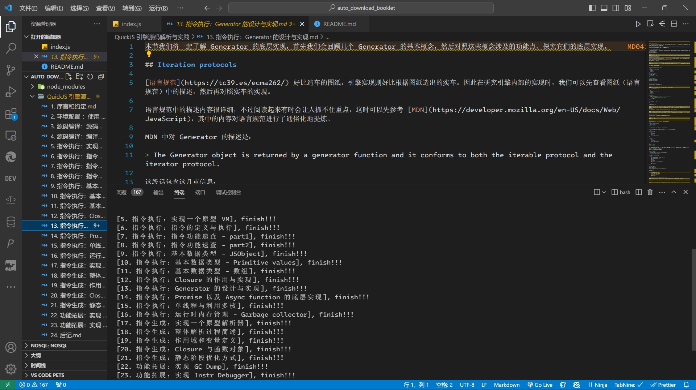

# download_juejin_booklet

运行脚本一键下载小册所有文章

## 运作原理

- 通过用户客户端cookie，请求时携带，得到booklet列表以及各自的info
- headers通过浏览器开发这工具，复制fetch方式获取headers, 赋值给常量REQUESTT_INIT

## 效果



## 使用方式

- 安装依赖

```bash
pnpm install
```

- 修改常量BOOKID
- 修改常量REQUESTT_INIT
- 执行命令

```bash
node index.js
```

## 免责声明

该脚本仅用于个人使用，严禁传播内容或用于商业目的。
脚本仅供使用者个人离线阅读付费文章之用。
如有侵权，请联系我们删除。使用脚本需遵守法律和平台规定，自行承担风险与责任。
